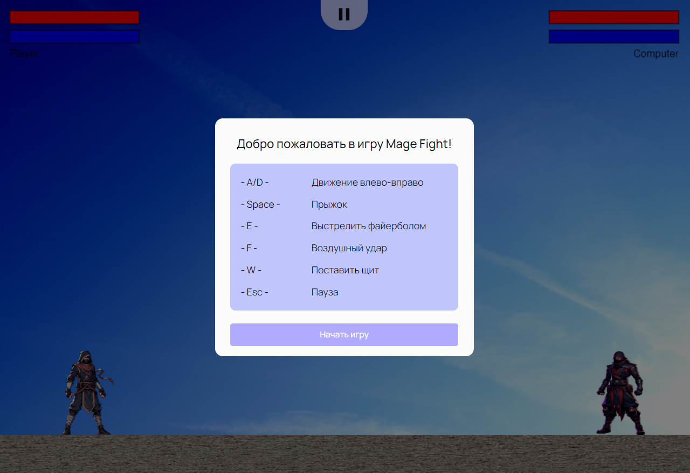

## Mage Fight

### Игра для 2 модуля Яндекс.Практикума

- [Прототип в фигме](https://www.figma.com/design/JxDvcmFWCqOx6ll6lmoTRD/MAGE-FIGHT)

- [Ссылка для деплоя на Версель](https://mage-fight.vercel.app/)

- [Документация](docs/README.md) (Порядок работы с проектом, сценарий игры)

---

## Инструкция по работе с исходными файлами репозитория

### Как запускать?

1. Убедитесь что у вас установлен `node` и `docker`
2. Выполните команду `yarn bootstrap` - обязательный шаг (без него ничего работать не будет)
3. Выполните команду `yarn dev`
4. Выполните команду `yarn dev --scope=client` чтобы запустить только клиент
5. Выполните команду `yarn dev --scope=server` чтобы запустить только server

### Как добавить зависимости?

В этом проекте используется `monorepo` на основе [`lerna`](https://github.com/lerna/lerna)

Чтобы добавить зависимость для клиента
`yarn lerna add {your_dep} --scope client`

Для сервера
`yarn lerna add {your_dep} --scope server`

И для клиента и для сервера
`yarn lerna add {your_dep}`

Если вы хотите добавить dev зависимость, проделайте то же самое, но с флагом `dev`
`yarn lerna add {your_dep} --dev --scope server`

### Тесты

Для клиента используется [`react-testing-library`](https://testing-library.com/docs/react-testing-library/intro/)

`yarn test`

### Линтинг

`yarn lint`

### Форматирование prettier

`yarn format`

### Production build

`yarn build`

Команды запуска превью:

`yarn preview --scope client`
`yarn preview --scope server`

## Хуки

В проекте используется [lefthook](https://github.com/evilmartians/lefthook)
Пропустить проверку принудительно можно через флаг `--no-verify`

## Автодеплой статики на vercel

Зарегистрируйте аккаунт на [vercel](https://vercel.com/)
Следуйте [инструкции](https://vitejs.dev/guide/static-deploy.html#vercel-for-git)
В качестве `root directory` укажите `packages/client`

Все ваши PR будут автоматически деплоиться на vercel. URL вам предоставит деплоящий бот

## Production окружение в докере

Перед первым запуском выполните `node init.js`

`docker compose up` - запустит три сервиса

1. nginx, раздающий клиентскую статику (client)
2. node, ваш сервер (server)
3. postgres, вашу базу данных (postgres)

Если вам понадобится только один сервис, просто уточните какой в команде
`docker compose up {sevice_name}`, например `docker compose up server`
