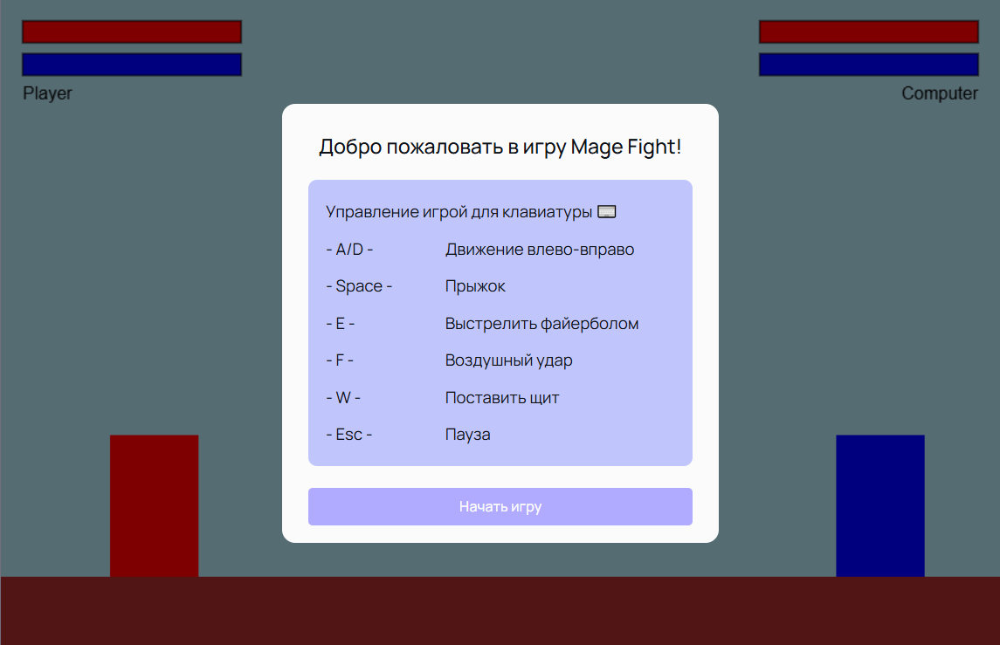
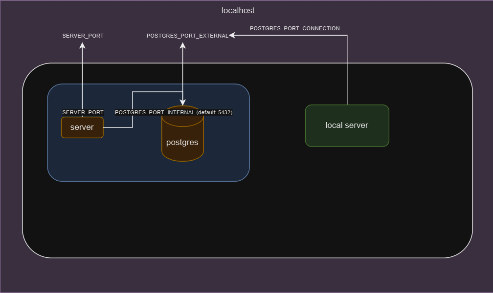

## Mage Fight

### Игра для 2 модуля Яндекс.Практикума

- Видео для командного зачёта: [первое](https://disk.yandex.ru/i/bemFDp9nvTfZHA), [второе](https://disk.yandex.ru/i/iu2oCUOj1yAxTA)

- [Прототип в фигме](https://www.figma.com/design/JxDvcmFWCqOx6ll6lmoTRD/MAGE-FIGHT)

- [Документация](docs/README.md) (Порядок работы с проектом, сценарий игры)

- [Отчет об утечках памяти](MEMORYLEAKS.md)

---

## Как запускать проект

#### Подготовка проекта

1. Убедитесь что у вас установлен `node` 20 версии и `docker`, установите зависимости командой `yarn bootstrap`

2. Создайте файлы `.env` и настройте их для режима разработки или продакшн

- должны быть 3 файла `.env` по образцам `.env.sample`: в корне проекта, в папках packages/client и packages/server

- переменную POSTGRES_HOST **для разработки** задаём как `localhost`, **для продакшн** задаём как `postgres`

- переменные POSTGRES_PORT_CONNECTION и POSTGRES_PORT_EXTERNAL задаём одинаково,например `5432` (см. схему ниже)

#### Режим разработки

- Запустите контейнер с базой данных через `docker-compose up postgres`

- Подготовьте базу данных по [инструкции](packages/server/README.md) (миграции, сидеры)

- Запустите приложение через `yarn dev` (порт `3000`)

#### Продакшн-сборка

- Соберите образы командой `docker-compose build --no-cache` и запустите через `docker-compose up -d`

- Подготовьте базу данных по той же [инструкции](packages/server/README.md)

- Проект доступен на порту `3001`

#### Схема работы проекта

---

## Работа с исходными файлами репозитория

### Тесты, Линтинг, Форматирование (prettier)

`yarn test`, `yarn lint`, `yarn format`

Для клиента используется [`react-testing-library`](https://testing-library.com/docs/react-testing-library/intro/)

### Добавление зависимостей

В этом проекте используется `monorepo` на основе [`lerna`](https://github.com/lerna/lerna)

Чтобы добавить зависимость для клиента
`yarn lerna add {your_dep} --scope client`

Для сервера
`yarn lerna add {your_dep} --scope server`

И для клиента и для сервера
`yarn lerna add {your_dep}`

Если вы хотите добавить dev зависимость, проделайте то же самое, но с флагом `dev`
`yarn lerna add {your_dep} --dev --scope server`

### Автодеплой статики на vercel

Зарегистрируйте аккаунт на [vercel](https://vercel.com/)
Следуйте [инструкции](https://vitejs.dev/guide/static-deploy.html#vercel-for-git)
В качестве `root directory` укажите `packages/client`

Все ваши PR будут автоматически деплоиться на vercel. URL вам предоставит деплоящий бот
