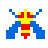
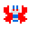
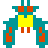

## Сценарий игры <!-- omit in toc -->

- [1. Общая идея](#1-общая-идея)
- [2. Требования к прототипу](#2-требования-к-прототипу)
- [3. Требования к MVP](#3-требования-к-mvp)
- [4. Опциональные требования](#4-опциональные-требования)
- [5. Примеры изображений игрока и врагов](#5-примеры-изображения-игрока-и-врагов)

### 1. Общая идея

#### Игрок и враг двигаются по ограниченной платформе вправо-влево, могут делать прыжки, а также атаковать противника

#### Цель игры - пройти уровень, уменьшив планку жизни врага до нуля

---

### 2. Требования к прототипу

_(игрок, враг, снаряды и панель жизни - геометрические фигуры)_

- [ ] Добавить несколько уровней для отдельного тестирования функционала

  - добавить возможность выбирать уровень на начальном экране игры

- [ ] Нарисовать панели жизни у игрока и врага

  - количество жизни не растёт, изначально полное

- [ ] Реализовать движение игрока и прыжки, в рамках платформы

  - добавить возможность смерти при падении с платформы

- [ ] Добавить стрельбу файрболами (огненными шарами)

  - отображается как изображение, движущееся от игрока до противоположного конца платформы
  - используется по нажатию клавиши `E` с интервалом в 3 секунды
  - не расходует ману и жизни (бесплатная атака)

- [ ] Добавить действие снаряда при столкновении с препятствием

  - нарисовать стационарного врага-заглушку
  - реализовать исчезновение снаряда при столкновении с врагом
  - реализовать снижение жизни врага на 20% при столкновении со снарядом

- [ ] Добавить панель поздравления при убийстве врага

---

### 3. Требования к MVP

_(игрок, враг, снаряды и панель жизни - спрайт-изображения)_

- [ ] Нарисовать панели маны у игрока и врага

  - мана восстанавливается со временем, изначально полная

- [ ] Добавить удар воздухом (используется с целью сдвинуть с платформы и убить падением)

  - отображается как серия однотипных изображений в виде линии от игрока до противоположного конца платформы
  - используется по нажатию клавиши `F` с интервалом в 5 секунд
  - расходует 20% маны
  - не сдвигает противника, если тот находится в прыжке

- [ ] Реализовать минимальное поведение врага, основанное на интервальном случайном выборе одного из действий:

  - движение вправо-влево (с целью держать расстояние до игрока ~20% платформы)
  - прыжок
  - стрельба огненным шаром

- [ ] Реализовать воздействие снарядов на игрока, снижение его жизни и панель конца игры при смерти игрока

- [ ] Добавить фон уровня

---

### 4. Опциональные требования

- [ ] Добавить активацию щита (защищает от огненного шара)

  - отображается как стационарное либо мигающее изображение перед игроком
  - длится 2 секунды, блокирует движение игрока
  - используется по нажатию клавиши `W` с интервалом в 5 секунд
  - расходует 20% маны

- [ ] Добавить ещё два уровня
  - добавить фоны уровней в том же стиле
  - добавить спрайты противников
  - настроить ограничения интеллекта врагов, чтобы на каждом уровне различалась частота действий

### 5. Примеры изображений игрока и врагов

_(кладём рядом в папку scenario)_

|               Враг               | Описание                                                                                                                                                |
| :------------------------------: | :------------------------------------------------------------------------------------------------------------------------------------------------------ |
|  | Базовый враг, в основном передвигается вместе с роем но иногда может отделяться и совершать налет на игрока. Редко стреляет.                            |
|  | Враг второго уровня, так же передвигается вместе с роем, отделается чаще для совершения налетов на игрока. Стреляет чаще.                               |
|  | Враг третьего уровня, передвигается вместе с роем, стреляет чаще чем враг второго уровня, может похитить корабль игрока. Уничтожается с двух попаданий. |
